# trace-viz

Trace visualization monorepo with automatic version detection and transformation.

## Architecture

### Processing Pipeline Overview

```mermaid
graph LR
    %% Layers
    subgraph Input["📥 INPUT LAYER"]
        Raw["Raw Trace Object<br/>{version, spans, metadata, ...}"]:::inputBox
    end
    
    subgraph Detection["🔍 DETECTION LAYER"]
        VD["Version Detector<br/>(JSONata Expression)"]:::detectionBox
        VDDetail["• Evaluates expression on trace<br/>• Returns version string<br/>• Falls back if needed"]:::detailBox
    end
    
    subgraph Registry["📚 REGISTRY LAYER"]
        VR["Visualizer Registry<br/>(Version → Component Map)"]:::registryBox
        VRDetail["• Exact match: version === '2'<br/>• Semantic match: '2.1.3' → '2.1' → '2'<br/>• Default fallback"]:::detailBox
    end
    
    subgraph Transform["⚙️ TRANSFORMATION LAYER"]
        TP["Trace Preparer<br/>(Optional)"]:::transformBox
        TPDetail["• Validates trace schema<br/>• Normalizes data structure<br/>• Enriches with metadata<br/>• Type-safe output"]:::detailBox
    end
    
    subgraph Output["📤 OUTPUT LAYER"]
        State["Orchestrator State"]:::outputBox
        StateDetail["• status: 'success' | 'error'<br/>• trace: PreparedTrace<br/>• version: string<br/>• visualizer: Component<br/>• error: Error | null"]:::detailBox
        Viz["Visualizer Component<br/>(React/Vue/Svelte)"]:::outputBox
    end
    
    %% Flow
    Raw --> VD
    VD -.->|"version string"| VDDetail
    VDDetail --> VR
    VR -.->|"component"| VRDetail
    VRDetail --> TP
    TP -.->|"prepared trace"| TPDetail
    TPDetail --> State
    State -.->|"contains"| StateDetail
    State --> Viz
    
    %% Styling
    classDef inputBox fill:#1a1a2e,stroke:#4a90e2,stroke-width:3px,color:#fff
    classDef detectionBox fill:#16213e,stroke:#e94560,stroke-width:3px,color:#fff
    classDef registryBox fill:#16213e,stroke:#9c27b0,stroke-width:3px,color:#fff
    classDef transformBox fill:#16213e,stroke:#ffa726,stroke-width:3px,color:#fff
    classDef outputBox fill:#1a1a2e,stroke:#66bb6a,stroke-width:3px,color:#fff
    classDef detailBox fill:#0f3460,stroke:#7986cb,stroke-width:1px,color:#ddd,font-size:11px
```



### Detailed Processing Flow


### End-to-End Sequence


## Packages

- **[@trace-viz/core](packages/core)**: Core orchestration library for trace visualization
- **[@trace-viz/react](packages/react)**: React hooks and components for trace visualization

## Development

```bash
# Install dependencies
pnpm install

# Build all packages
pnpm build

# Watch mode for all packages
pnpm dev

# Run tests
pnpm test

# Run tests in watch mode
pnpm test:watch

# Lint
pnpm lint

# Typecheck
pnpm typecheck

# Format
pnpm format
```

## Release Process

This project uses [Changesets](https://github.com/changesets/changesets) for versioning and publishing.

1. Create a changeset: `pnpm changeset`
2. Commit the changeset
3. Open a PR
4. On merge to main, a "Version Packages" PR will be created
5. Merge the version PR to publish to npm

## Contributing

- Use [conventional commits](https://www.conventionalcommits.org/)
- Run `pnpm test` before committing
- Ensure all checks pass before merging

## License

MIT